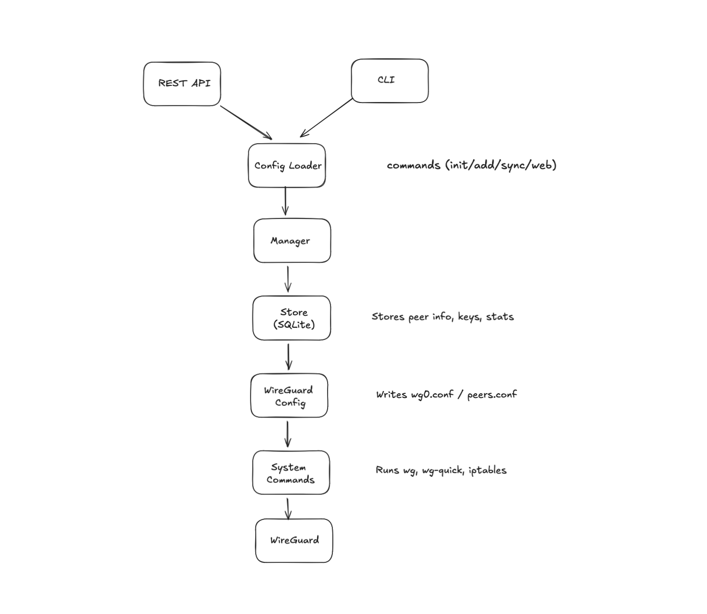

# Tunnel Manager

**Tunnel Manager** is a self-hosted VPN orchestration tool. With a powerful CLI and REST API, Tunnel Manager makes it effortless to create, manage, and monitor VPN tunnels and peers - no manual config editing required.

---

## Features

- Add/remove VPN peers with automatic IP allocation
- Generate client configs for quick onboarding
- CLI for core control-plane tasks (init, up/down, sync)
- Minimal REST API for programmatic peer management
- Stores keys and peer data securely in SQLite
- Generates WireGuard configs and NAT/interface rules automatically

---

## System Architecture



---

## Quick Start

1. **Install Go & WireGuard**
2. **Clone this repo**
3. **Build:**
   ```sh
   go build -o vpn
   ```
4. **Initialize:**
   ```sh
   ./vpn init
   ```
5. **Start REST API (optional):**
   ```sh
   ./vpn web
   ```

---

## Common Commands

- `./vpn add <peer-name>` - Add a new peer
- `./vpn remove <peer-name>` - Remove a peer
- `./vpn list` - List peers
- `./vpn up` - Bring up the VPN interface
- `./vpn down` - Bring down the VPN interface
- `./vpn sync` - Apply peer changes to a running interface
- `./vpn web` - Start the REST API (localhost only)